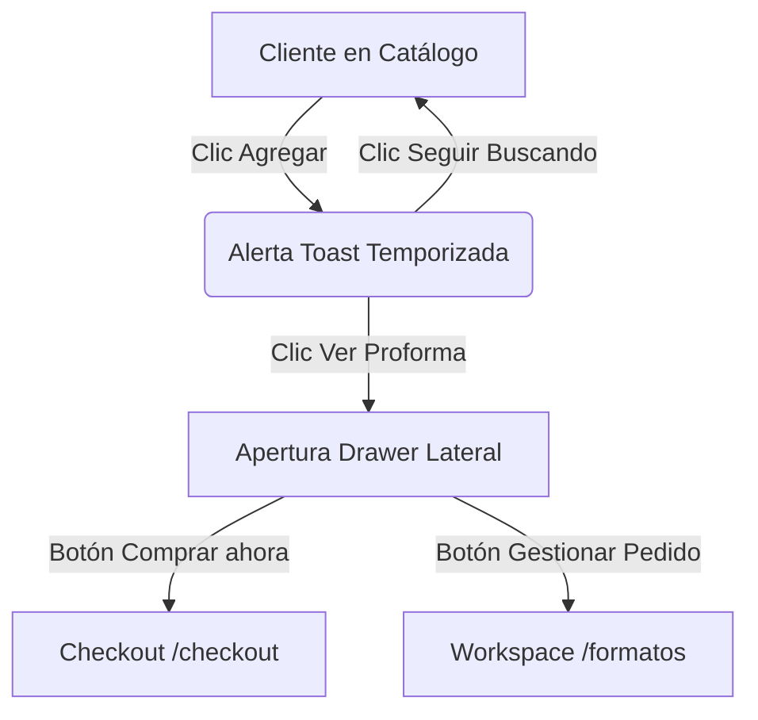

# Notas de Actualización de Diseño y Flujos del Sistema (Fase 2 y 3)

Este documento actúa como la especificación de planificación y diseño de la arquitectura de flujos de usuario (B2B/B2C), transiciones FSM y la estrategia de desacoplamiento de cotizaciones mediante el **Patrón de Clonación**. 

Su propósito es servir como guía unificada de referencia tanto para desarrolladores como para agentes de inteligencia artificial (IA) que mantengan el sistema.

---

## 1. Perfiles de Usuario y Lógica de Onboarding (UX/UI)

El sistema evalúa dinámicamente el estado del actor en la ruta de **Gestionar Pedido** (`/formatos`) utilizando dos variables del contexto: `isAuthenticated` (autenticación) y `hasHistory` (presencia de cotizaciones o consultas previas en la base de datos). 

Esto determina el diseño de la interfaz y los flujos disponibles:

---

### A. Cliente sin Cuenta (GUEST)
* **Objetivo:** Facilitar la compra rápida directa (B2C) sin fricción de registro.
* **Condición de activación:** `isAuthenticated = false`.
* **Especificaciones del comportamiento en `/formatos`:**
  * **Sesión Silenciosa:** El sistema resuelve el borrador mediante la cookie de sesión `order_token` (FSM en estado `BORRADOR` para invitados). Si no tiene sesión, el cliente la inicializa de manera automática mediante un `POST /formatos/session`.
  * **Filtro de Interfaz (B2C Restringido):** 
    - Oculta por completo la opción **"Generar Cotización PDF"** (`BTN-FU-004`).
    - Oculta por completo la opción **"Solicitar Asesoría"** (`BTN-FU-003`).
    - Oculta el widget lateral de historial y cualquier aviso de vigencia comercial.
  * **Controles Permitidos:** El usuario solo puede:
    1. Visualizar su tabla de productos agregados.
    2. Modificar cantidades con el componente `QuantityInput`.
    3. Subir listas masivas por Excel (el importador de Excel `BTN-FU-011` y `BTN-FU-012` está disponible para compras rápidas).
    4. Hacer clic en **"Comprar ahora"** (se cambia el estado a `PEDIDO` y se le redirige a `/checkout`).

---

### B. Cliente Corporativo Nuevo (CUSTOMER sin historial)
* **Objetivo:** Guiar y educar al nuevo usuario B2B sobre cómo formalizar compras e inmutabilidad de precios.
* **Condición de activación:** `isAuthenticated = true` y `hasHistory = false`.
* **Especificaciones del comportamiento en `/formatos`:**
  * **Pantalla de Bienvenida (Borrador Vacío):**
    - Se muestra el **Área de Inicio de Pedido** en el bloque central.
    - Se renderiza la **Guía Visual de Onboarding B2B** en 3 pasos con diseño de tarjetas informativas:
      1. **Paso 1 (Agregar):** Indica que puede añadir ítems navegando por el catálogo o arrastrando un archivo Excel en el dropzone central.
      2. **Paso 2 (Cotizar):** Explica que al presionar "Generar Cotización PDF", sus precios se congelarán por 15 días mediante un documento legal/comercial.
      3. **Paso 3 (Pagar):** Explica cómo formalizar el pedido ingresando sus datos en el checkout para activar el envío Shalom.
  * **Comportamiento al añadir productos:** Una vez que se agrega al menos un producto al borrador, el onboarding se desplaza hacia abajo o se minimiza, abriendo paso a la tabla activa de productos y habilitando los botones B2B (`Generar Cotización` y `Solicitar Asesoría`).

---

### C. Cliente Corporativo Recurrente (CUSTOMER con historial)
* **Objetivo:** Acelerar el flujo de recompra recurrente y la gestión de cotizaciones inmutables y consultas anteriores.
* **Condición de activación:** `isAuthenticated = true` y `hasHistory = true`.
* **Especificaciones del comportamiento en `/formatos`:**
  * **Colocación del Widget de Recompra (Esquina/Lateral Derecho):**
    - El área central de la pantalla se reserva de manera prioritaria para la **Zona de Trabajo: Gestión Completa** (`/formatos`), evitando la saturación.
    - En la columna lateral derecha (junto al resumen de precios), se pinta el **Widget de Recompra** que lista las últimas 3 cotizaciones cerradas del cliente.
  * **Mecánica de Reutilización de Plantillas (Dos Botones/Acciones):**
    Para cada cotización histórica listada en el widget, se ofrecen dos acciones de carga:
    1. **"Reemplazar Borrador" (`BTN-FU-008a`):** 
       - *Acción:* Limpia completamente el borrador activo actual (elimina todos sus ítems en base de datos) y copia la lista de productos y cantidades de la cotización histórica seleccionada en el borrador.
       - *Confirmación:* Abre un modal de advertencia: *"¿Seguro que deseas reemplazar tu borrador actual? Los productos que tienes seleccionados ahora se perderán."*
    2. **"Combinar con Borrador" (`BTN-FU-008b`):** 
       - *Acción:* Realiza una fusión inteligente. Lee los productos de la cotización histórica y los agrega al borrador activo. Si un producto ya estaba seleccionado en el borrador, **suma las cantidades** en lugar de duplicar la fila.
       - *Confirmación:* Muestra un Toast de éxito indicando: *"Se han combinado [N] productos al borrador actual."*
  * **Visualización de Estados FSM Activos (Banners):**
    - Si el cliente tiene una cotización vigente (`COTIZACIÓN`) o una consulta en revisión (`CONSULTA`), la cabecera de la página `/formatos` renderiza el **`BannerFSM`** correspondiente.
    - Si el cliente accede a editar (Borrador Activo), el banner no aparece, permitiéndole trabajar normalmente gracias al patrón de clonación que mantiene el borrador vacío e independiente.

---

## 2. Flujo de Navegación del Catálogo (Toast & Drawer)

El flujo de adición de productos al Formato Único en estado `BORRADOR` se gestiona mediante micro-interacciones no intrusivas:



1. **Acción de Adición:** Al hacer clic en "Agregar a mi Formato", el sistema muestra una **tarjeta flotante temporizada (Toast)** en la esquina superior derecha confirmando el producto agregado.
2. **Decisión del Usuario:**
   * **"Seguir buscando":** Cierra la alerta y permite continuar la navegación.
   * **"Ver proforma":** Abre el **Drawer lateral derecho** mostrando el resumen rápido de los productos cargados.
3. **Interacción con el Símbolo del Carrito (Header):**
   * El Drawer Lateral también se accede en cualquier momento haciendo clic en el **Símbolo del Carrito** ubicado en la parte superior derecha del Header global.
   * **Comportamiento visual del Carrito (Header):**
     - *Badge dinámico:* Muestra un indicador numérico flotante con la cantidad de ítems agregados (ej: `[3]`).
     - *Efecto Hover:* Despliega un menú rápido (Tooltip/Popover) resumiendo la cantidad de productos y un subtotal estimado, con la indicación de hacer clic para gestionar el formato.
     - *Efecto Click:* Desliza el Drawer Lateral de derecha a izquierda.
4. **Controles y Visualización en el Drawer Lateral (Carrito con ítems):**
   * **Listado de Ítems:** Cada línea del producto muestra su nombre, SKU, miniatura de imagen, selector de cantidad rápido `[ - | Qty | + ]`, y un botón con icono de papelera para eliminar el ítem individualmente sin salir del catálogo.
   * **Subtotal Neto:** Muestra la suma del precio total en Soles (S/.) recalculado en tiempo real según el catálogo vigente (`RN-PRICING-05`).
   * **Botón Primario ("Comprar ahora"):** De color verde destacado (ej. `#10B981`). Transiciona la FSM del borrador de `BORRADOR` a `PEDIDO` y redirige al usuario a la pantalla de **Checkout (`/checkout`)** para rellenar datos de envío y facturación, completando la compra rápida.
   * **Botón Secundario ("Gestionar Pedido"):** Estilo secundario/discreto. Redirige a la zona de trabajo completa en la ruta **`/formatos`** para realizar tareas avanzadas (subir Excel, cotizar formalmente con precios congelados, o pedir asesoría).

---

## 3. Zona de Trabajo: Gestión Completa (`/formatos`)

Ubicada en el menú principal (`SCR-FU-001`), esta pantalla presenta las herramientas y botones del Formato Único ordenados por prioridad:

### A. Carga Masiva y Plantillas
1. **`BTN-FU-012` - "Descargar Plantilla":** Permite bajar el archivo estándar CSV/Excel para el cargador masiva.
2. **`BTN-FU-011` - "Importar Excel" / `BTN-FU-013` - "Confirmar Importación Excel":** Abre el modal de arrastrar y soltar archivo y valida la disponibilidad de inventario en lote. Habilitado únicamente en estado `BORRADOR`.

### B. Gestión de Ítems Individuales
3. **`BTN-FU-001` - "Eliminar" (por ítem):** Remueve un producto específico de la lista activa.
4. **`BTN-FU-002` - "Vaciar Formato Único":** Elimina todos los ítems agregados, devolviendo el formato a estado vacío. Habilitado solo en estado `BORRADOR`.

### C. Resolución de Conflictos y Soporte Pre-Venta
5. **`BTN-FU-003` - "Solicitar Asesoría" (o Consulta):** Transiciona el FU al estado `CONSULTA` (`FU-T-02`) para que un vendedor revise y responda las dudas del cliente antes de cotizar o comprar.
6. **`BTN-FU-014` - "Consultar por Telegram (Individual)":** Abre un chat en Telegram con un mensaje pre-armado consultando stock de un SKU específico en fila naranja.
7. **`BTN-FU-015` - "Consultar Masivo por Telegram":** Abre Telegram con un mensaje que concatena todos los SKUs con stock insuficiente para cotización externa de soporte corporativo.
8. **`BTN-FU-016` - "Limpiar Filas con Error":** Elimina en bloque todas las filas que tengan SKU inexistente o error crítico (filas rojas). Su confirmación abre un modal de seguridad. La postcondición es que al limpiar los errores críticos, **se habilita automáticamente el botón "Generar Cotización"**.

### D. Finalización y Pago
9. **`BTN-FU-004` - "Generar Cotización":** Transiciona el formato a `COTIZACIÓN` (`FU-T-03` / `FU-T-07`), congelando los precios por **15 días** (según `RN-FU-03`) y generando el PDF con las cláusulas cambiarias y de stock internacional.
10. **`BTN-FU-005` - "Comprar ahora" / "Ir a Checkout":** Transiciona el formato de `BORRADOR` (flujo rápido) o de `COTIZACIÓN` al estado `PEDIDO` e inicia el formulario de pago en `/checkout`.

---

## 4. Estrategia de Desacoplamiento: Patrón de Clonación

Para solucionar el bloqueo del carrito de compras cuando existe una cotización vigente sin alterar la base de datos de manera compleja, se define el **Patrón de Clonación**:

```
[Borrador Activo - ID: 001] (Contiene Ítems) 
             │
             ▼ Clic en "Generar Cotización"
 ┌───────────┴───────────┐
 │                       │
 ▼ (Clonación)           ▼ (Limpieza)
[Cotización - ID: 999]  [Borrador Activo - ID: 001]
- Estado: COTIZACIÓN     - Estado: BORRADOR
- Ítems: Congelados      - Ítems: Vacío (Listo)
- Vigencia: 15 días      
```

### Lógica del Flujo:
1. Al hacer clic en "Generar Cotización", el sistema **clona** el `FormatoUnico` actual creando un nuevo registro en la base de datos con estado `COTIZACIÓN`.
2. El `FormatoUnico` original (el carrito) se limpia de ítems y permanece en estado `BORRADOR`. El cliente puede seguir agregando productos de inmediato.
3. **Cancelación Independiente (`RF-FU-020` / `BTN-FU-008`):**
   * Si el cliente cancela la Cotización (ID: 999), esta cambia su estado de `COTIZACIÓN` a `BORRADOR`.
   * Pasa a ser un **Borrador Histórico/Independiente** en su historial.
   * **No se mezcla ni altera** al Borrador Activo en curso (ID: 001). El cliente tiene ahora múltiples borradores en su perfil que puede activar o eliminar por separado.

---

## 5. Matriz de Impacto y Trazabilidad de la Actualización

A continuación se detalla cómo se asocian estos flujos con la documentación modificada de la Fase 2 y 3:

| Elemento | Código ID | Impacto / Modificación en la Documentación |
| :--- | :--- | :--- |
| **Requisito Funcional** | **`RF-FU-010`** | Modificado para describir el historial completo de Formatos Únicos en cualquier estado FSM (pre-compra). |
| **Requisito Funcional** | **`RF-FU-012`** | Modificado para enfocar el historial únicamente en transacciones con Órdenes de Compra (`PEDIDO`, `CONFIRMADO`). |
| **Caso de Uso** | **`UC-FU-007`** | Actualizado el disparador al historial `/cuenta/formatos` y el filtro dinámico de `customer_id`. |
| **Caso de Uso** | **`UC-FU-008`** | **[NUEVO]** Caso de uso detallado para la consulta del Historial de Pedidos corporativos (`RF-FU-012`). |
| **Criterio de Aceptación** | **`CA-FU-010`** | **[NUEVO]** Escenario Gherkin para la consulta y control de accesos al historial de Formatos Únicos. |
| **Criterio de Aceptación** | **`CA-FU-011`** | **[NUEVO]** Escenario Gherkin para el filtrado del historial de Pedidos excluyendo borradores. |
| **Regla de Negocio** | **`RN-FU-03`** | Actualizada la vigencia de cotización de 7 días a **15 días** calendario. |
| **Regla de Negocio** | **`RN-FU-07`** | **[NUEVO]** Cláusula Cambiaria: Variaciones del tipo de cambio USD/Soles pueden invalidar o actualizar la cotización. |
| **Regla de Negocio** | **`RN-FU-08`** | **[NUEVO]** Cláusula de Precios Internacionales: Fluctuaciones globales facultan cambios en el precio cotizado. |
| **Caso de Prueba** | **`TEST-FU-010`** | Pruebas integradas para verificar el aislamiento de datos por `customer_id` y el filtrado por estados. |

